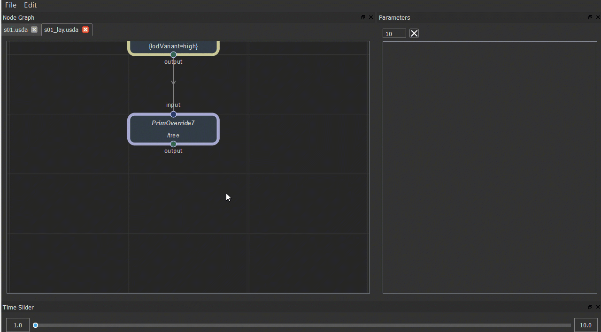

# UsdNodeGraph


You can use the node view to preview the usd file and simply edit the usd file, such as overriding prim, switching variants, adding references or payloads, and modifying attributes.


## Current Support

NodeGraph:
+ Create new node by pressing 'Tab'
+ Copy and paste
+ Disable node using 'D'
+ Get into node(Layer or Reference) by pressing 'Ctrl+Enter'

Node:
+ Layer
+ PrimDefine
+ PrimOverride
+ Reference
+ Payload
+ Variant
+ Material
+ Shader

Parameter:
+ Edit number parameter using Middle Key

    

+ Show keyframe in different color

    

+ Connect shader

    


## Dependence

+ [PyQt4](https://www.lfd.uci.edu/~gohlke/pythonlibs/#pyqt4)
or PyQt5
or [PySide](https://www.lfd.uci.edu/~gohlke/pythonlibs/#pyside)
or [PySide2](http://download.qt.io/snapshots/ci/pyside/)

+ [Qt.py](https://github.com/mottosso/Qt)


## Plugins

usdview:


```bash
export PYTHONPATH=$USD_NODEGRAPH_ROOT/lib/python:$PYTHONPATH
export PYTHONPATH=$USD_NODEGRAPH_ROOT/plugin:$PYTHONPATH
export PXR_PLUGINPATH_NAME=$USD_NODEGRAPH_ROOT/plugin:$PXR_PLUGINPATH_NAME
```

maya:
```bash
export PYTHONPATH=$USD_NODEGRAPH_ROOT/lib/python:$PYTHONPATH
```

```python
from AL import usdmaya
stageCache = usdmaya.StageCache.Get()
stages = stageCache.GetAllStages()
stage = stages[0]
layer = stage.GetEditTarget()

import usdNodeGraph.ui.nodeGraph as usdNodeGraph
reload(usdNodeGraph)
usdNodeGraph.UsdNodeGraph.registerActionShortCut('open_file', None)
usdNodeGraph.UsdNodeGraph.registerActionShortCut('reload_layer', 'Ctrl+R')

nodeGraph = usdNodeGraph.UsdNodeGraph()

nodeGraph.show()
nodeGraph.setStage(stage, layer=layer)
```


## TODO
+ Support add custom parameter to node;
+ Support add keyframe on parameter;
+ Update stage when parameter get changed;
+ Connect to other DCC's time state


## Known Issues

+ **If there are some data which are unsupported by UsdNodeGraph in the usd file, they will not be displayed in the view, and the data will be lost when saved.**
+ The 'Export' menu actually export the usd file to another file except the opened one for now.(Because of data lost)
+ It will be very slow to open a usd file which has many prims.(I have test with a file with about 10000 prims and it will cost 35 seconds to load and create about 20000 nodes) You can set the environment 'USD_NODEGRAPH_DEBUG' to 'debug' and see the loading time and number of nodes.
+ The viewport update mode is set to 'SmartViewportUpdate' by default for performance. You can set it to 'FullViewportUpdate' by setting the environment 'USD_NODEGRAPH_FULL_VIEWPORT_UPDATE' to '1'.
+ **This is still a very simple version, please don't use it in production.**
