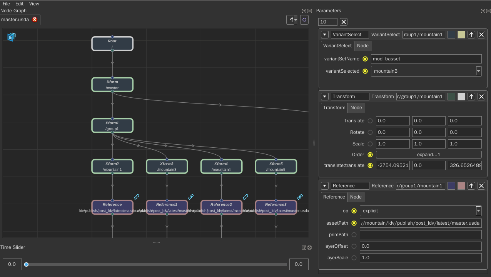
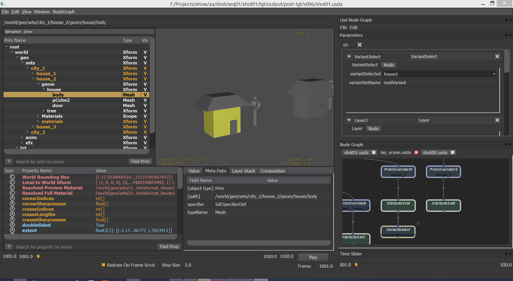

# UsdNodeGraph



You can use the node view to preview the usd file and simply edit the usd file, such as overriding prim, switching variants, adding references or payloads, and modifying attributes.


## Current Support

NodeGraph:
+ Create new node by pressing 'Tab'
+ Copy and paste
+ Disable node using 'D'
+ Get into node(Layer or Reference) by pressing 'Ctrl+Enter'

Node:
+ Layer
+ PrimDefine
+ PrimOverride
+ Reference
+ Payload
+ Variant
+ Material
+ Shader

See more in [Supports](Supports.md)

## Dependence

+ [PyQt4](https://www.lfd.uci.edu/~gohlke/pythonlibs/#pyqt4)
or PyQt5
or [PySide](https://www.lfd.uci.edu/~gohlke/pythonlibs/#pyside)
or [PySide2](http://download.qt.io/snapshots/ci/pyside/)

+ [Qt.py](https://github.com/mottosso/Qt)


## Plugins

usdview:



```bash
export PYTHONPATH=$USD_NODEGRAPH_ROOT/lib/python:$PYTHONPATH
export PYTHONPATH=$USD_NODEGRAPH_ROOT/plugin:$PYTHONPATH
export PXR_PLUGINPATH_NAME=$USD_NODEGRAPH_ROOT/plugin:$PXR_PLUGINPATH_NAME
```

maya:


```bash
export PYTHONPATH=$USD_NODEGRAPH_ROOT/lib/python:$PYTHONPATH
```

```python

import mayaUsd.ufe
from maya import cmds


def whenParameterChanged(**kwargs):
    # proxy shape not update when stage changed, so use refresh() to force updating the view
    if kwargs.get('node').Class() in ['AttributeSet', 'Transform']:
        cmds.refresh()


def whenChangesApplied(**kwargs):
    cmds.refresh()


def whenStateFrameChanged(**kwargs):
    cmds.currentTime(kwargs.get('time'))


proxyShape = '|world|s00|s00Shape'
stage = mayaUsd.ufe.getStage(proxyShape)

import usdNodeGraph.api as usdNodeGraphApi

usdNodeGraphApi.UsdNodeGraph.registerActionShortCut('open_file', None)
usdNodeGraphApi.UsdNodeGraph.registerActionShortCut('save_layer', None)
usdNodeGraphApi.GraphState.addCallback('layerChangesApplied', whenChangesApplied)
usdNodeGraphApi.GraphState.addCallback('parameterValueChanged', whenParameterChanged)
usdNodeGraphApi.GraphState.addCallback('stageTimeChanged', whenStateFrameChanged)

nodeGraph = usdNodeGraphApi.UsdNodeGraph()

nodeGraph.show()
nodeGraph.setStage(stage)
```


## Api
```python
import usdNodeGraph.api as usdNodeGraphApi

usdNodeGraphApi.Node.setParamDefault('PrimDefine', 'label', '/[value primName]')
usdNodeGraphApi.Node.registerActions([])  # see plugin/usdViewNodeGraph.py example
usdNodeGraphApi.Parameter.getParameterTypes()  # support parameter types
usdNodeGraphApi.GraphState.setCurrentTime(time, stage)
usdNodeGraphApi.GraphState.addCallback(callbackType, func)

```


## TODO
+ Support add custom parameter to node;
+ Support undo and redo;
+ ~~Support add keyframe on parameter;~~
+ ~~Update stage when parameter get changed;~~
+ ~~Update stage when node connected or deleted;~~
+ ~~Connect to other DCC's time state;~~ See #5


## Known Issues

+ **If there are some data which are unsupported by UsdNodeGraph in the usd file, they will not be displayed in the view, and the data will be lost when saved.**

    Please create a new issue if you see any data lost.

    How to know if there's data lost: 

    1. Open the usd file by usdnodegraph;
    2. Export the file by 'Export' button;
    3. Compare two files.

+ It will be very slow to open a usd file which has many prims.(I have test with a file with about 10000 prims and it will cost 35 seconds to load and create about 20000 nodes) You can set the environment 'USD_NODEGRAPH_DEBUG' to 'debug' and see the loading time and number of nodes.
+ The viewport update mode is set to 'SmartViewportUpdate' by default for performance. You can set it to 'FullViewportUpdate' by setting the environment 'USD_NODEGRAPH_FULL_VIEWPORT_UPDATE' to '1'.
