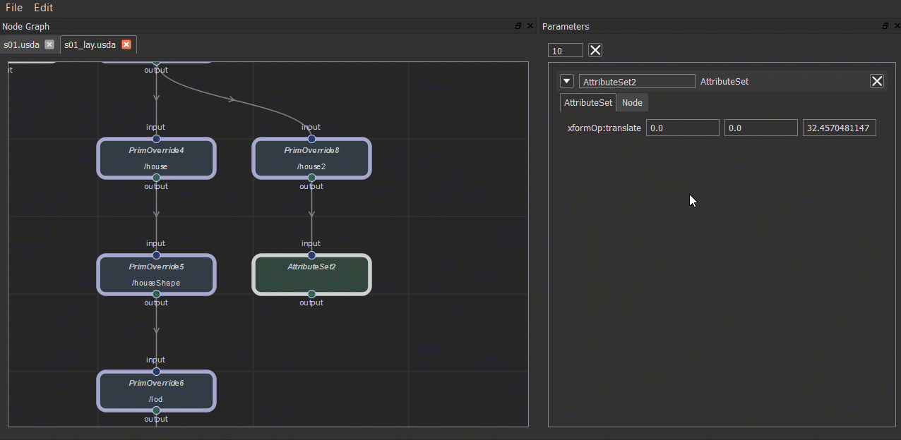
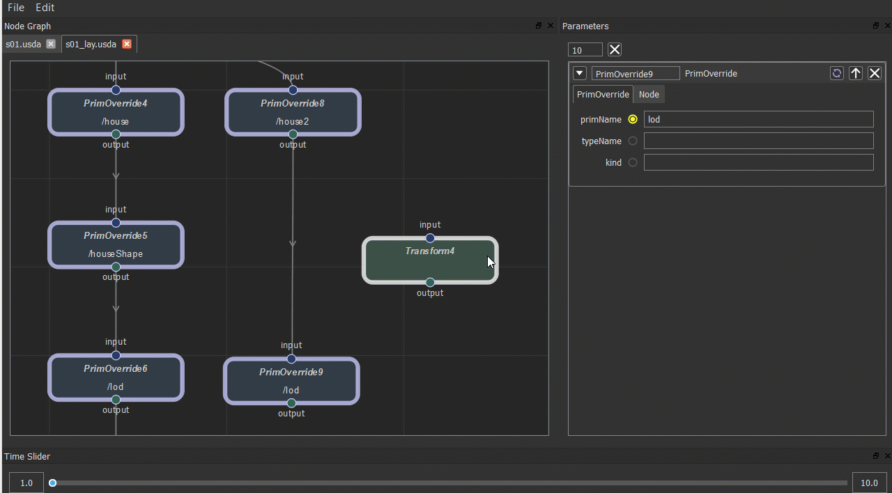
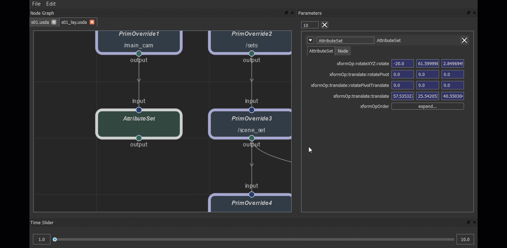
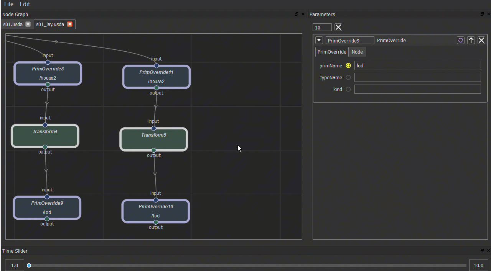
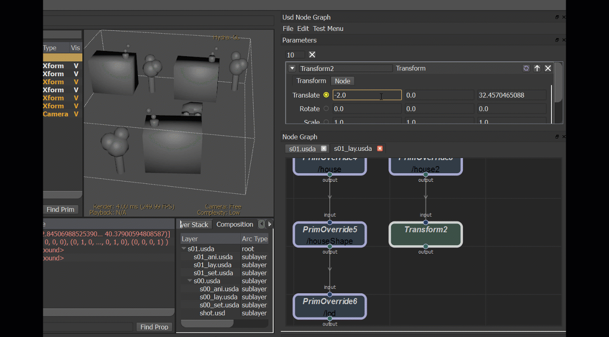
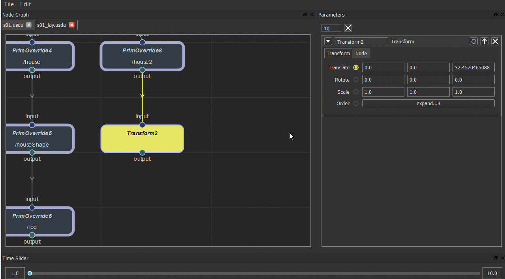

# Supports

## Node
+ Create

    Press 'Tab'
    
    

+ Connect

    

+ Copy & Paste

    

+ Disable

    

## Parameter

+ Edit Number Parameter

    

+ Add/Remove Keyframe

    

+ Set/Unset Connect
    
    todo

+ Add Custom Parameter

    todo

+ Update Stage When Changed(Only for AttributeSet node)

    
    
+ Override Status Button

## Maya

