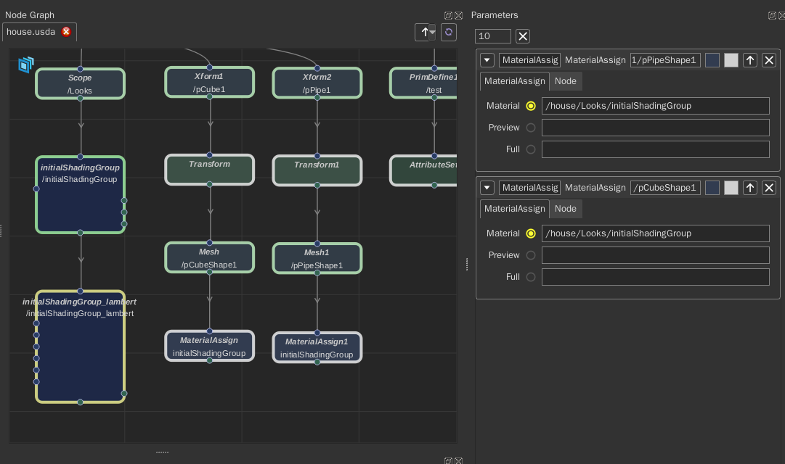

# Supports

## Node
+ Create

    Press 'Tab'

    

+ Connect

    

+ Copy & Paste

    

+ Disable

    

+ Shader

    

+ Change Color


## Parameter

+ Edit Number Parameter

    

+ Add/Remove Keyframe

    

+ Set/Unset Connect

    todo


+ Add Custom Parameter

    todo


+ Update Stage When Changed(Only for AttributeSet node)

    
    
+ Override Status Button


## CEL Path

UsdNodeGraph has a CEL path resolver like katana. 
This allow you to assign material to many prims just in one node.

Current support(The text below is from katana's dev guide):

### Selecting Objects by Name

Explicitly select the object at a path:

```
/root/world/cam_main
```

Select all immediate children of /root/world whose names start with “lgt”:

```
/root/world/lgt*
```

Select all objects recursively beneath /root/materials:

```
/root/materials//*
```

Select all objects named “shape” anywhere within the scene:

```
//shape
```

### Combining Sets

Adjacent sets without any operator are implicity unioned. This statement selects both of those paths:

```
/root/world/lgt_key /root/world/lgt_fill
```

This statement is equivalent to the last:

```
/root/world/lgt_key + /root/world/lgt_fill
```

Select all of the immediate children of /root/world except for “lgt_rim”:

```
/root/world/lgt* - /root/world/lgt_rim
```

This example demonstrates that set operations are evaluated from left to right. This results in only /root/world/b:

```
/root/world/a + /root/world/b - /root/world/a
```

Parentheses may be used to control the order of evaluation. This example results in all immediate children of /root/world whose names begin with “cam” or “lgt” but which aren’t named “cam_main”, “cam_taco” or “lgt_rim”:

```
(/root/world/cam* - (/root/world/cam_main /root/world/cam_taco)) + (/root/world/lgt* - /root/world/lgt_rim)
```

Select all immediate children of /root/world whose name contains both “a” and “b” in any order:

```
/root/world/*a* ^ /root/world/*b*
```

### Collections

CEL will treat one word 'my_collection' as collection name and 
resolve the collection CEL attribute paths in '/collection/my_collection' prim.


## UNG Mode and File Format

The nodes in scene can be saved as '.ung' file(xml format). 
This will allow you to use your custom node and save the edit status.

When you save the nodes by click **'File -> Save Scene Nodes'**, 
the nodes in current scene will be saved to a .ung file whaich has a same name with current layer.
And the next time you open this layer, usdNodeGraph will load the .ung file to scene as ung mode, 
not reload based on layer.
You can switch ung mode and usd node by click the switch button.

Let's assume that you have created a CollectionCreate node and created a collection, 
then a MaterialAssign2 node and assign material to that collection.


This is same as you create MaterialAssign node and assign material under each prim node.



This is very useful if you have material assigned to lots of prims.
There will be many Prim and MaterialAssign nodes in usd mode.
If you changed the material path, in usd mode, you need to find all MaterialAssign node and change the material path.
But in ung mode, you just need to change once.


## Maya

This is an example workflow using usdNodeGraph. Test with maya 2020.2 and maya-usd 0.3.0.

1. Load the [master.usda](examples/layer/master.usda) file in maya and rename the node to "s00";

2. Open UsdNodeGraph and set the stage(using the code in [README](README.md));

3. Go into set.usda Layer node;

4. Create a Xform node and connect it to 'Xform(/world)'. Set parameter 'primName' to 'house1';

5. Create a 'Reference' node and connect it to 'Xform1' node. Set parameter 'assetPath' to the path of [house.usda](examples/model/house.usda);

6. Click **'File->Apply'** or use 'Ctrl+Shift+A' short cut, then you can see the house in maya;

7. Copy the created two nodes and paste, change the 'Xform2' node 'primName' parameter to 'house2'. Apply the changes and there will be two houses in scene. You can check it in maya outliner;

8. Go into layout.usda Layer node;

9. Move the house2 to other place in maya's viewer, go back to UsdNodeGraph and click **'File->Reload Layer'**. There should be two 'PrimOverride' nodes and a 'Transform' node. You can see and edit the translate value in parameter panel after double click the node.

10. You can save current edit by click **'File->Save Layer'**.

